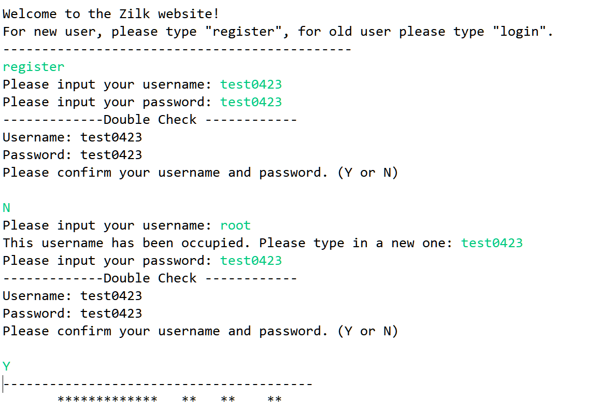

## Zilk Online Website Running Guidance

- This is a normal Java Project which can be executed from the Eclipse. The executable file is the Zilk/src/main.java.
- All interative commands are from the command line. We are using command line to mock the real website.

### Step 1 - Login Part
There are 2 ways for users to login. If the user the a new user, register option has been provied. If this is an existing user, this user can log in to the website.

#### Step 1.1 - Register
The whole business logic of Register might be very complex. The below picture has showed the all possible options.
- If the username has been occupied, user need to input again.
- If the username has not been used, user will be able to register and then enter the shopping part after double check.

#### Step 1.2 - Login
Login will be a little bit complex. Generally speaking, we have provided 3 options:
- User can choose to register a new account if user doesn't have a valid account. Then, user can enter the shopping part.

- User can log out if he/she shows no interest in this part. 

- User can successfully log in the shopping part if the username and password are both correct.

### Step 2 - Shopping Part
The whole shopping part is very simple. Currently, we only have 3 products in out website. The shopping part has 4 options.
- Add product to the cart. User can type in integer or digits to add product to their cart.
- Remove product from the cart. User can type in negative integer ot digits to remove product from their cart.
- Quit from shopping part. User can log out by tying q.
- Enter the Check out stage. User can type in "Check" to check out.

### Step 3 - Checkout Part
The checkout part is very very simple. As this will be a huge part including the payment and validation, our design and implementation only will support the order sent to mailbox. Users will pay via the order detailed link.
- User can confirm the order or quit from the website.

### Others Unit Test

[More](design)